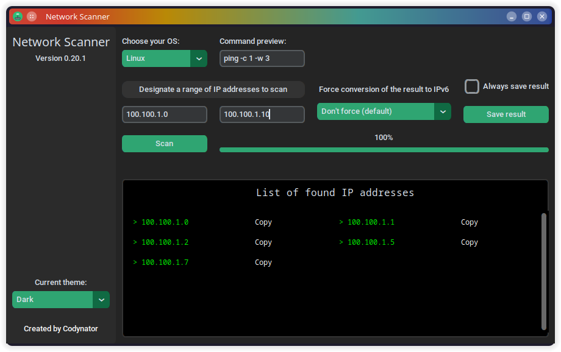
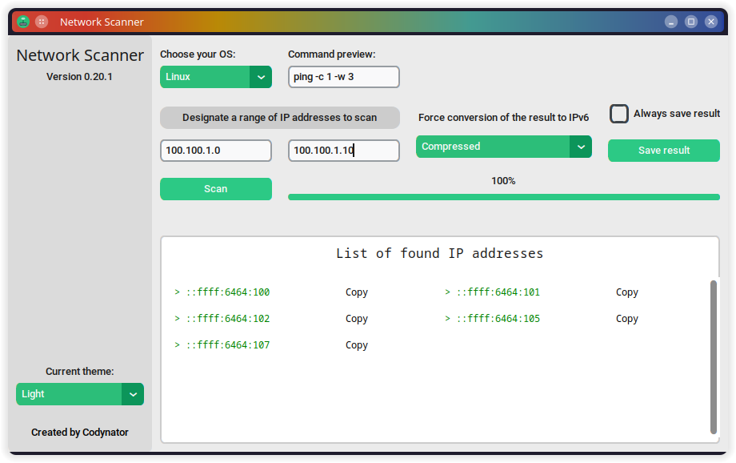

# Network Scanner

> Remember, work on the application is still in progress, expect bugs.

An easy-to-use network scanner that pings IP addresses from designated range. Supports both IPv4 and IPv6.
Runs Linux and Windows (has been tested on Ubuntu 24.04, Windows 10 and Windows 11). 
GUI created using [CustomTkinter](https://customtkinter.tomschimansky.com/) module.

## Getting started

1. Download or clone the repository.
2. Navigate to the repository’s location in the terminal and run following command to install required modules:  
 `pip install -r requirements.txt`  
  **You can delete specific module version in `requirements.txt` so that pip installs the latest version.**
3. Now you’re all set!

## How to use
1. The scanner automatically detects the operating system and set a proper ping command by default.
If automatic detection fails, you can manually specify the OS or edit the command visible in the entry on the right.
2. Designate a range of IP addresses. The input fields accept both IPv4 and IPv6 formats but remember to **use the 
same format in both entries** (don't mix IPv4 with IPv6 or two different formats of IPv6) Otherwise, the scan may fail.
3. **Optional:** You can force conversion of found IP addresses to chosen IPv6 format.
4. Press scan button. If the designated range is large, scanning may take few minutes.
5. When scan is finished, you can copy each of addresses. You can also save them to txt file by pressing `Save result`
button.

> When `Always save result` is checked, the scanner saves the result after each scan. **It doesn't save when you check
or uncheck it**.

### Ping command flags explanation

| Flag on Windows      | Flag on Linux | Description                    |
|----------------------|---------------|--------------------------------|
| -n [number]          | -c [number]   | Number of packets send to host |
| -w [milliseconds]    | -w [seconds]  | Length of timeout              |

## Settings

- **Strict check** - activates input validation and prevents badly entered IP addresses from blocking scanning 
capabilities. However, if the validation is not working properly, you can disable it by setting `strict_check`
to `False` in `conf.yaml`.

## Knows issues
1. During the process of clearing the list of found IP addresses, it can throw *CustomTkinter*'s errors in the terminal.
They shouldn't have any impact on the scanner's workflow.
2. On Windows, the GUI may appear glitched sometimes.